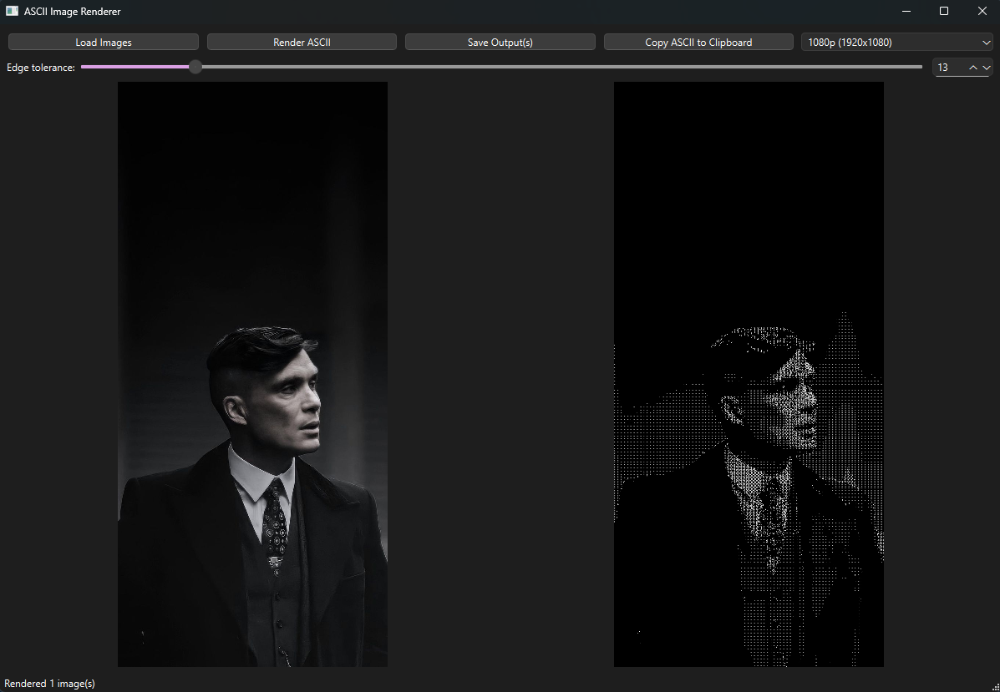
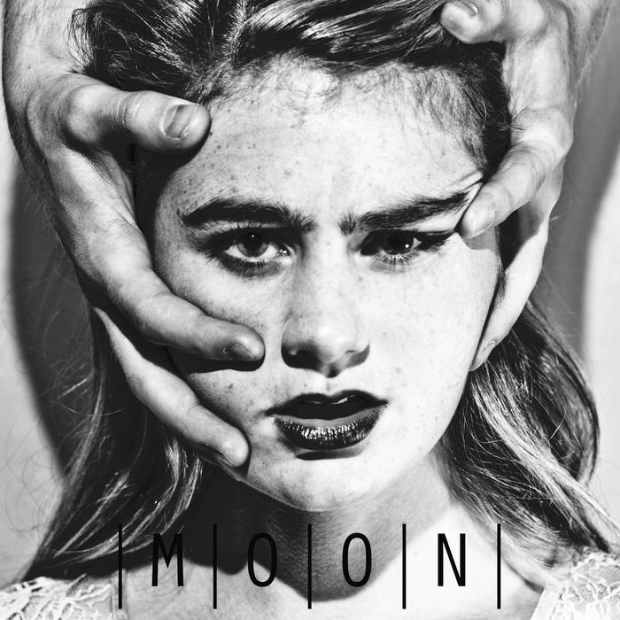

# ASCII Renderer + GUI
A simple desktop application to convert images into ASCII art using Python. Users can adjust resolution, edge detection sensitivity, and process multiple images at once.






## Features
- Load one or multiple images at once.
- Render ASCII art previews in real time.
- Adjust up/downscale resolution: choose from presets or enter custom width/height.
- Adjust edge detection sensitivity using a slider or numeric input.
- Save rendered ASCII images to a folder of your choice.
   - Or print as ASCII text

**NOTE**: GUI saves output with "_ascii" appended to picture name. Use CLI to save with same name

## Installation
### Option 1: Run executable
1) Download the latest release from the [Releases](https://github.com/asbou45115/ascii_renderer/releases)
 page.
2) Extract the .zip
3) Double-click main.exe to open the GUI.
4) Load images, adjust settings, and render ASCII art.

### Option 2: CLI
1) Clone repo:
    ```bash
    git clone https://github.com/asbou45115/ascii_renderer.git
    cd ascii_renderer
    ```

2) Create a Python virtual environment (optional but recommended - Not required if using UV package manager):
    ```bash
    python -m venv venv
    venv\Scripts\activate
    ```

3) Install dependencies:
    ```bash
    pip install -r requirements.txt
    ```
    OR with UV package manger:
    ```bash
    uv sync
    ```

4) Run application:
    ```bash
    python main.py <input_file/input_folder> <output_file/output_folder> [--upscale_width UPSCALE_WIDTH] [--upscale_height UPSCALE_HEIGHT] [--edge_tolerance EDGE_TOLERANCE] [--text]
    ```
    OR 
    ```bash
    uv run main.py <input_file/input_folder> <output_file/output_folder> [--upscale_width UPSCALE_WIDTH] [--upscale_height UPSCALE_HEIGHT] [--edge_tolerance EDGE_TOLERANCE] [--text]
    ```

    Usage Examples (use python or uv run):
    - Single image:
      ```bash
      python main.py images/image.png output/image.png --upscale_width 1920 --upscale_height 1080 --edge_tolerance 15
      ```
   -  Folder of images:
      ```bash
      python main.py images/ output/ --upscale_width 1280 --upscale_height 720 --edge_tolerance 10
      ```

   For terminal print (one image):
      ```bash
      python main.py images/image.png output/image.png --upscale_width 1920 --upscale_height 1080 --edge_tolerance 15 --text # Can add >> ascii.txt to output ASCII to text file
      ```
   Arguments:
   - `<input_path>` – Path to an image file or folder of images.
   - `<output_path>` – Output file or folder path.
   - `--width / --height` – Upscale dimensions (optional).
   - `--edge` – Edge tolerance for detail sensitivity (optional, default: 13).
   - `--text` – Prints ASCII art directly to the terminal instead of saving an image.
      

## How it Works
The ASCII Renderer converts images into ASCII art using a combination of image processing and character mapping. Here's a step-by-step breakdown:

1) **Image Loading and scaling**  
   - Image is scaled using **Lanczos interpolation** to preserve quality while enlarging or downscaling

2) **Grayscale Conversion**  
   - The image is converted to **grayscale**
   - This allows us to map the luminance values (0-255) to their respective ASCII characters

3) **Downsampling to ASCII Grid**  
   - The image is resized to a **coarse grid** where each cell corresponds to one ASCII character (8×8 pixels by default).  
   - This reduces detail to match the size of ASCII characters while preserving overall structure.

4) **Brightness Mapping to ASCII Characters**  
   - Each cell's average brightness is mapped to a character in a **predefined ASCII set**: `" .:coPO?@■"`, from darkest to brightest.  
   - This ensures brighter areas are represented by dense characters (e.g., `@`, `■`) and darker areas by lighter ones (e.g., `.`, ` `).

5) **Edges**  
   - To emphasise edges, the renderer applies a **Difference of Gaussians (DoG)** filter:  
     - Blur the grayscale image twice with different sigma values (`sigmaX=1` and `sigmaX=4`)
     - Subtract the blurred images to highlight high-frequency components   
    - Sobel filter is then applied to the new DoG'd image
        - Sobel computes the **gradient magnitude and direction** of pixels in an image
        - Pixels with gradient magnitude above the **edge tolerance** threshold are treated as edges.  
        - The edge orientation is used to select a character representing the edge (`-`, `/`, `|`, `\`).

7) **Upscaling ASCII Grid**  
   - The ASCII character grid is resized back to the original image resolution using **nearest-neighbor interpolation**


